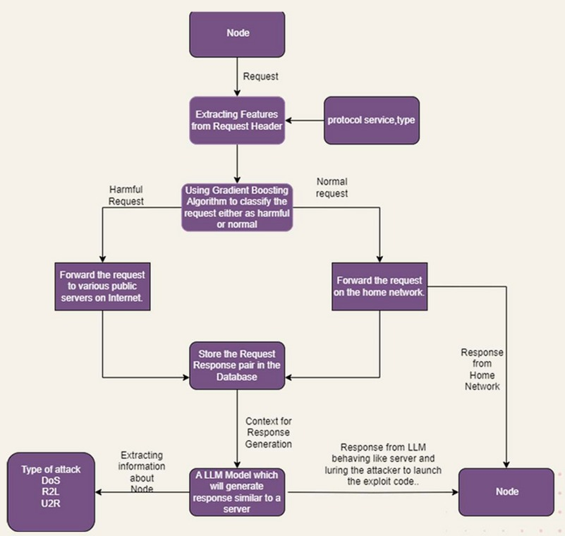

# AIHoneyPot 🛡️🤖

AIHoneyPot is an intelligent cybersecurity system that combines **machine learning** and **active deception techniques** to detect, divert, and engage malicious attackers in real-time. It analyzes network traffic, classifies threats using a trained ML model, and redirects harmful requests to an AI-powered honeypot that simulates realistic server behavior.

---

## 🚀 Features

### 🔍 Intelligent Threat Detection
Incoming server requests are inspected using packet analysis. The following features are extracted for classification:

- `duration`
- `protocol_type`
- `service`
- `src_bytes`
- `dst_bytes`
- `flag`
- `wrong_fragment`
- `urgent`
- `srv_count`

These features are fed into a **trained Gradient Boosting Model** which classifies each request as:

- ✅ Normal  
- ⚠️ Harmful

---

### 🔄 Smart Traffic Routing

- **Normal Requests** → Forwarded to the actual server  
- **Harmful Requests** → Redirected to AIHoneyPot

---

### 🎭 AI-Powered Honeypot

When a request is detected as dangerous:

1. The AIHoneyPot forwards it to real internet servers.
2. Observes real responses.
3. Learns server behavior and response patterns.
4. Crafts realistic fake responses for attackers.
5. Engages attackers to slow them down and collect intelligence.

---

### 🧠 Attacker Intelligence Collection

The system logs attacker details such as:

- IP address
- Request patterns
- Payload behavior
- Targets
- Frequency
- Port

This data can be used for:
- Threat analysis
- Intrusion pattern recognition
- Training better security models

---

## 🏗️ Tech Stack

- Python
- Scikit-learn (Gradient Boosting Model)
- Network Packet Analysis
- Langchain (AI-based Response Generation)

---

## Flowchart


---

## ⚙️ Getting Started

Follow the steps below to set up AIHoneyPot:

---

### 1️⃣ Clone the Repository

```bash
git clone https://github.com/spiralMonster/AIHoneyPot.git
cd AIHoneyPot

```

### 2️⃣ Create a Virtual Environment
```bash
python3 -m venv venv
```

###  3️⃣ Activate the Virtual Environment
```bash
source venv/bin/activate
```

### 4️⃣ Install Dependencies
```
pip install -r requirements.txt

```

### 5️⃣ Run AIHoneyPot
```bash
sudo path/of/venv/python main.py server_url
```

---

## Author

Developed by Amartya Pawar (spiralMonster)